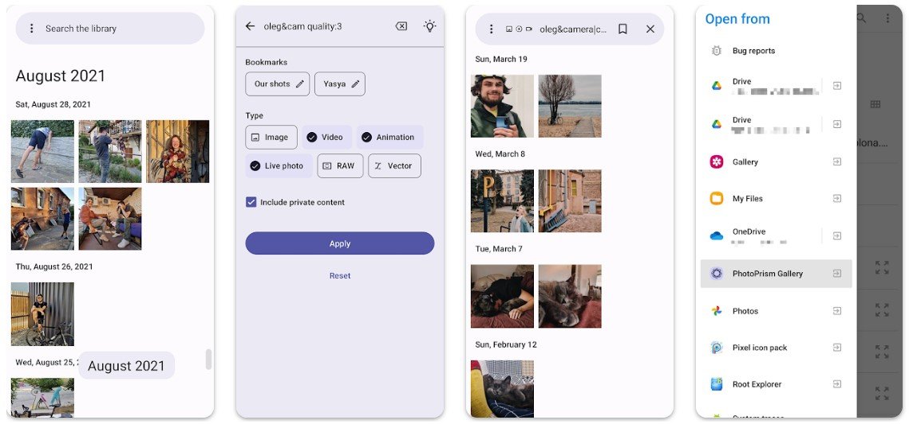

##  Android Gallery

[PhotoPrism Gallery](https://github.com/Radiokot/photoprism-android-client) is an open source native Android gallery and content provider for your library. 

The app does not (and probably will not) support all the web-client features, but nevertheless it can:
- Provide the library content to other Android apps – you can select PhotoPrism Gallery among other galleries when picking a photo or video
- Open the library content in suitable apps – you can use your favorite image editor or video player instead of web viewer

There are more usefull features in the app, such as chronological fast scroll and search bookmarks. Install PhotoPrism Gallery from [ GitHub Releases](https://github.com/Radiokot/photoprism-android-client/releases/latest), [ F-Droid](https://f-droid.org/packages/ua.com.radiokot.photoprism) or [ Google Play](https://play.google.com/store/apps/details?id=ua.com.radiokot.photoprism)
