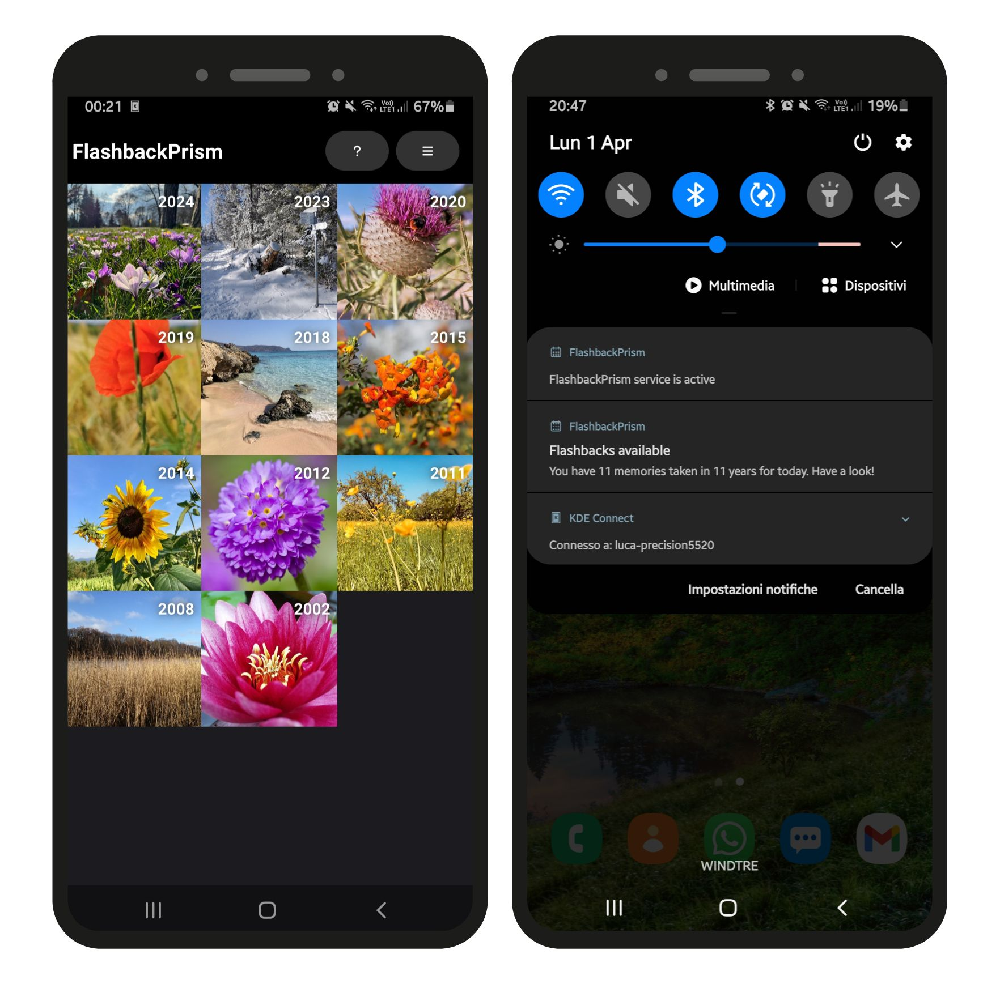

##  FlashbackPrism

[FlashbackPrism](https://bugfreeblog.duckdns.org/flashbackprism) is an open source PhotoPrism client that presents photos from your library taken today in previous years. The application also notifies daily about memories from your library by presenting a notification in the morning.

The application supports Linux, MacOS, Windows, Android and iOS. Only on Android, however, the app notifies daily when the app is not running.
I only provide binaries for Android arm64 [here](https://bugfreeblog.duckdns.org/flashbackprism). For different builds, you'll have to build [from the sources](https://github.com/carlonluca/flashbackprism).